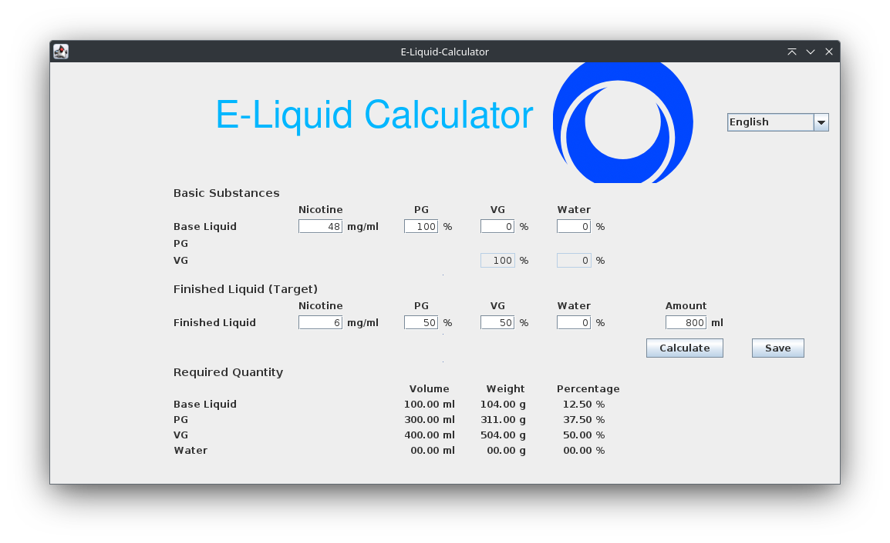

[](https://drone.phoenix.ipv64.de/David/java-e-liquid-calculator) for `main`<br />
[](https://drone.phoenix.ipv64.de/David/java-e-liquid-calculator) for `develop`<br />
[](https://sonarqube.phoenix.ipv64.de/dashboard?id=de.dddns.kirbylink%3Ae-liquid-calculator)
[](https://sonarqube.phoenix.ipv64.de/dashboard?id=de.dddns.kirbylink%3Ae-liquid-calculator)
[](https://sonarqube.phoenix.ipv64.de/dashboard?id=de.dddns.kirbylink%3Ae-liquid-calculator)
[](https://sonarqube.phoenix.ipv64.de/dashboard?id=de.dddns.kirbylink%3Ae-liquid-calculator)
[](https://sonarqube.phoenix.ipv64.de/dashboard?id=de.dddns.kirbylink%3Ae-liquid-calculator)
[](https://sonarqube.phoenix.ipv64.de/dashboard?id=de.dddns.kirbylink%3Ae-liquid-calculator)<br />
[](https://sonarqube.phoenix.ipv64.de/dashboard?id=de.dddns.kirbylink%3Ae-liquid-calculator)
[](https://sonarqube.phoenix.ipv64.de/dashboard?id=de.dddns.kirbylink%3Ae-liquid-calculator)
[](https://sonarqube.phoenix.ipv64.de/dashboard?id=de.dddns.kirbylink%3Ae-liquid-calculator)<br />
[](https://sonarqube.phoenix.ipv64.de/dashboard?id=de.dddns.kirbylink%3Ae-liquid-calculator) <br />
[](https://sonarqube.phoenix.ipv64.de/dashboard?id=de.dddns.kirbylink%3Ae-liquid-calculator) for `main`<br /> 
[](https://sonarqube.phoenix.ipv64.de/dashboard?id=de.dddns.kirbylink%3Ae-liquid-calculator&branch=develop) for `develop`<br /> 

# Java E-Liquid Calculator

## Table of Contents / Inhaltsverzeichnis
- [English](#english)
  - [Introduction](#introduction)
  - [Features](#features)
  - [Installation and Usage](#installation-and-usage)
    - [Using the Source Code](#using-the-source-code)
    - [Using the Compiled JAR](#using-the-compiled-jar)
    - [Using Executable Files](#using-executable-files)
      - [Windows](#windows-en)
      - [macOS](#macos-en)
      - [Linux](#linux-en)
  - [Usage](#usage)
    - [Terminal](#terminal-en)
    - [GUI](#gui-en)
      - [Saving Your Mixture](#saving-your-mixture)
  - [Localization](#localization)
    - [Language and Country Settings](#language-and-country-settings)
    - [Explanation of JVM Options](#explanation-of-jvm-options)
      - [Resources](#resources)
    - [Examples with Language and Country Settings](#examples-with-language-and-country-settings)
    - [Language and Country Settings in the GUI](#language-and-country-settings-in-the-gui)
  - [Building the Project](#building-the-project)
  - [Deleting the Application](#deleting-the-application)
  - [Contributing](#contributing)
  - [License](#license)
  - [Contact](#contact)
- [Deutsch](#deutsch)
  - [Einführung](#einführung)
  - [Funktionen](#funktionen)
  - [Installation und Verwendung](#installation-und-verwendung)
    - [Verwendung des Quellcodes](#verwendung-des-quellcodes)
    - [Verwendung der Kompilierten JAR](#verwendung-der-kompilierten-jar)
    - [Verwendung ausführbarer Dateien](#verwendung-ausführbarer-dateien)
      - [Windows](#windows-de)
      - [macOS](#macos-de)
      - [Linux](#linux-de)
  - [Verwendung](#verwendung)
    - [Terminal](#terminal-de)
    - [GUI](#gui-de)
      - [Mischung speichern](#mischung-speichern)
  - [Lokalisierung](#lokalisierung)
    - [Sprache und Ländereinstellungen](#sprache-und-ländereinstellungen)
    - [Erklärung der JVM-Optionen](#erklärung-der-jvm-optionen)
      - [Ressourcen](#ressourcen)
    - [Beispiele mit Sprach- und Ländereinstellungen](#beispiele-mit-sprach--und-ländereinstellungen)
    - [Sprache und Ländereinstellungen in der GUI](#sprache-und-ländereinstellungen-in-der-gui)
  - [Projekt Bauen](#projekt-bauen)
  - [Anwendung löschen](#anwendung-löschen)
  - [Mitwirken](#mitwirken)
  - [Lizenz](#lizenz)
  - [Kontakt](#kontakt)

## English

### Introduction
Java E-Liquid Calculator is a comprehensive tool designed to help users create their own e-liquid mixtures with precision. This application allows you to input your desired nicotine strength, PG/VG ratio, and shows the necessary volume or weight of each ingredient.

The easiest way to mix your liquid is to use a scale and the weight of the individual ingredients.

The program is inspired by [rauchfrei.x-pressive.com](https://www.rauchfrei.x-pressive.com/calculator.html) and can be used as a backup if the site is unavailable, there is no internet access, or when local execution is preferred.

### Features
- Calculate precise e-liquid recipes based on your desired parameters.
- Can be used in the terminal or with the provided GUI.
- Save and load your preferred mixing ratio.
- Platform-independent, supporting Windows, macOS, and Linux.

### Installation and Usage

#### Using the Source Code
To build and run the application from the source, follow these steps:
1. Clone the repository:
   ```bash
   git clone https://github.com/kirbylink/java-e-liquid-calculator.git
   cd java-e-liquid-calculator
   ```
2. Build the project using Maven:
   ```bash
   mvn clean verify
   ```
   Or to skip the tests during the build:
   ```bash
   mvn clean package -Dmaven.test.skip=true
   ```
3. [Use the Compiled JAR](#using-the-compiled-jar) or run the application:
   ```bash
   mvn exec:java -Dexec.mainClass="de.dddns.kirbylink.eliquidcalculator.ELiquidCalculatorApplication"
   ```

#### Using the Compiled JAR
If you have a Java Runtime Environment (JRE) installed, you can use the compiled JAR file:
1. [Compile the source code](#using-the-source-code) or download the latest release (JAR that ends with `-jar-with-dependencies`) from the [Releases](https://github.com/kirbylink/java-e-liquid-calculator/releases) page.
2. Double-click the JAR file (you may need to make it executable first, depending on your OS) or, if your OS doesn't support this, run the JAR file:
   ```bash
   java -jar e-liquid-calculator-1.1.11-jar-with-dependencies.jar
   ```

#### Using Executable Files
For a more straightforward experience, you can use the platform-specific executables:

<h5 id="windows-en">Windows</h3>

<div markdown="1">

1. Download `e-liquid-calculator-1.1.11-jar-with-dependencies-windows-x64.exe` or `e-liquid-calculator-1.1.11-jar-with-dependencies-windows-x64.zip` from the [Releases](https://github.com/kirbylink/java-e-liquid-calculator/releases) page and extract it.
2. Double-click the executable to run the application.

</div>

<h5 id="macos-en">macOS</h3>

<div markdown="1">

1. Download `e-liquid-calculator-1.1.11-jar-with-dependencies-macos-x64.tar.gz` from the [Releases](https://github.com/kirbylink/java-e-liquid-calculator/releases) page and extract it.
2. Double-click `e-liquid-calculator-1.1.11-jar-with-dependencies-macos-x64.app`.

</div>

<h5 id="linux-en">Linux</h3>

<div markdown="1">

1. Download `e-liquid-calculator-1.1.11-jar-with-dependencies-linux-x64` or `e-liquid-calculator-1.1.11-jar-with-dependencies-linux-x64.tar.gz` from the [Releases](https://github.com/kirbylink/java-e-liquid-calculator/releases) page and extract it.
2. Make the file executable if necessary:
   ```bash
   chmod +x e-liquid-calculator-1.1.11-jar-with-dependencies-linux-x64
   ```
3. Double-click the executable to run the application, or if your OS doesn't support it, run the application:
   ```bash
   ./e-liquid-calculator-1.1.11-jar-with-dependencies-linux-x64
   ```

</div>

### Usage

You can start the program with optional parameters. To get all parameters, start the program with `-h` or `--help`:
```bash
usage: java -jar e-liquid-calculator-1.1.11-jar-with-dependencies.jar
 -a,--amount <arg>           The total amount of finished liquid
 -bn,--base-nicotine <arg>   The nicotine content in the base liquid
 -bp,--base-pg <arg>         The percentage of PG in the base liquid
 -bv,--base-vg <arg>         The percentage of VG in the base liquid
 -bw,--base-water <arg>      The percentage of water in the base liquid
 -g,--gui                    Launch the GUI interface
 -h,--help                   Print this help message
 -n,--nicotine <arg>         The nicotine content in the finished liquid
 -p,--pg <arg>               The percentage of PG in the finished liquid
 -v,--vg <arg>               The percentage of VG in the finished liquid
    --version                Print this program's version number and Java
                             VM information
 -w,--water <arg>            The percentage of water in the finished
                             liquid
```

<h4 id="terminal-en">Terminal</h3>

<div markdown="1">

To run the application in the terminal, you need at least the parameters `-a,--amount <arg>` and `-p,--pg <arg>` (0 <= arg <= 1). If `-p` is less than 1, you must also provide `-v,--vg <arg>` and/or `-w,--water <arg>` so that the sum of PG, VG, and water equals 1.

Example Input:
```bash
java -jar e-liquid-calculator-1.1.11-jar-with-dependencies.jar -a 800 -p 1
```
Result:
```bash
Required amounts
-----------------------------------------------------------
                Volume          Weight          Percentage
Base liquid:    000.00 ml       000.00 g        00.00%
PG:             800.00 ml       829.00 g        100.00%
VG:             000.00 ml       000.00 g        00.00%
Water:          000.00 ml       000.00 g        00.00%
-----------------------------------------------------------
```

Example Input:
```bash
java -jar e-liquid-calculator-1.1.11-jar-with-dependencies.jar -a 800 -p 0.5 -v 0.5
```
Result:
```bash
Required amounts
-----------------------------------------------------------
                Volume          Weight          Percentage
Base liquid:    000.00 ml       000.00 g        00.00%
PG:             400.00 ml       414.00 g        50.00%
VG:             400.00 ml       504.00 g        50.00%
Water:          000.00 ml       000.00 g        00.00%
-----------------------------------------------------------
```

Note: Currently, the terminal is not working for the executable file for Windows. To provide a well-known user experience on Windows, the terminal is by default disabled (silent). For more information about the build process, see [Building the Project](#building-the-project).

</div>

<h4 id="gui-en">GUI</h3>

<div markdown="1">

The GUI can be launched without a parameter or with the additional parameter `-g,--gui`. All provided parameters will be used in the application.



Missing required fields will be marked with a red border and a warning dialog when you press the `Calculate` button.

If there is a misconfiguration in the PG/VG ratio, the negative result values will also be marked with a red border.

</div>

##### Saving Your Mixture
You can save your preferred mixing ratio by clicking on the `Save` button. The mixture will be saved in a file called `default_values.properties` and is automatically loaded when the application is restarted.

### Localization

#### Language and Country Settings
The application supports different languages and country settings. You can set the language and country by adding JVM options.

**Example**<br />
To set the language to German (`de`) and the country to Germany (`DE`):
```bash
java -Duser.language=de -Duser.country=DE -jar e-liquid-calculator-1.1.11-jar-with-dependencies.jar
```

#### Explanation of JVM Options
- `-Duser.language`: Sets the language of the application. For example, `en` for English, `de` for German.
- `-Duser.country`: Sets the country of the application. For example, `US` for the United States, `DE` for Germany.

More information about language and country options can be found here:
- [Java Locale Documentation](https://docs.oracle.com/javase/8/docs/api/java/util/Locale.html)
- [List of ISO 639-1 language codes](https://en.wikipedia.org/wiki/List_of_ISO_639-1_codes)
- [List of ISO 3166-1 Alpha-2 country codes](https://en.wikipedia.org/wiki/ISO_3166-1_alpha-2) 

##### Resources
The language files are located in the `src/main/resources/messages` folder. Feel free to contribute additional languages. See [Contributing](#contributing)

#### Examples with Language and Country Settings
- English (default):
  ```bash
  java -Duser.language=en -Duser.country=EN -jar e-liquid-calculator-1.1.11-jar-with-dependencies.jar
  ```
- German:
  ```bash
  java -Duser.language=de -Duser.country=DE -jar e-liquid-calculator-1.1.11-jar-with-dependencies.jar
  ```

#### Language and Country Settings in the GUI
The language can also be changed in the GUI. Select your preferred language in the dropdown box.

The JVM options are optional but can be used for the initial language.

### Building the Project
For detailed instructions on how to build the project from source, please refer to [BUILD.md](./BUILD.md).

### Deleting the Application
Delete the executable or JAR file (and optionally the git repository).
- Configuration Data:
  - Windows: `C:\Users\<User>\AppData\Roaming\e-liquid-calculator`
  - macOS: `/Users/<User>/Library/Application Support/e-liquid-calculator`
  - Linux: `/home/<User>/.config/e-liquid-calculator`
- Application Data:
  - Windows: `C:\Users\<User>\AppData\Local\warp\packages`
  - macOS: `/Users/<User>/Library/Application Support/warp/packages`
  - Linux: `/home/<User>/.local/share/warp/packages`

### Contributing
Contributions to the project from the community are welcome. Please read our [CONTRIBUTING.md](./CONTRIBUTING.md) for guidelines on how to contribute.

### License
This project is licensed under the MIT License - see the [LICENSE](./LICENSE) file for details.

### Contact
For any questions or feedback, please open an issue on GitHub.

## Deutsch

### Einführung
Der Java E-Liquid Calculator ist ein umfassendes Tool, das Benutzern hilft, ihre eigenen E-Liquid-Mischungen präzise zu erstellen. Diese Anwendung ermöglicht es Ihnen, Ihre gewünschte Nikotinstärke, das PG/VG-Verhältnis einzugeben und zeigt das notwendige Volumen oder Gewicht jeder Zutat an.

Der einfachste Weg, Ihr Liquid zu mischen, ist die Verwendung einer Waage und das Abwiegen der einzelnen Zutaten.

Das Programm ist inspiriert von [rauchfrei.x-pressive.com](https://www.rauchfrei.x-pressive.com/calculator.html) und kann als Backup verwendet werden, falls die Seite nicht verfügbar ist, kein Internetzugang besteht oder eine lokale Ausführung bevorzugt wird.

### Funktionen
- Berechnung präziser E-Liquid-Rezepte basierend auf Ihren gewünschten Parametern.
- Kann im Terminal oder mit der bereitgestellten GUI verwendet werden.
- Speichern und Laden Ihres bevorzugten Mischungsverhältnisses.
- Plattformunabhängig, unterstützt Windows, macOS und Linux.

### Installation und Verwendung

#### Verwendung des Quellcodes
Um die Anwendung aus dem Quellcode zu erstellen und auszuführen, folgen Sie diesen Schritten:
1. Klonen Sie das Repository:
   ```bash
   git clone https://github.com/kirbylink/java-e-liquid-calculator.git
   cd java-e-liquid-calculator
   ```
2. Bauen Sie das Projekt mit Maven:
   ```bash
   mvn clean verify
   ```
   Oder um die Tests während des Builds zu überspringen:
   ```bash
   mvn clean package -Dmaven.test.skip=true
   ```
3. [Verwenden Sie das kompilierte JAR](#verwendung-des-kompilierten-jar) oder führen Sie die Anwendung aus:
   ```bash
   mvn exec:java -Dexec.mainClass="de.dddns.kirbylink.eliquidcalculator.ELiquidCalculatorApplication"
   ```

#### Verwendung der Kompilierten JAR
Wenn Sie eine Java Runtime Environment (JRE) installiert haben, können Sie die kompilierte JAR-Datei verwenden:
1. [Kompilieren Sie den Quellcode](#verwendung-des-quellcodes) oder laden Sie die neueste Version (JAR, die mit `-jar-with-dependencies` endet) von der [Releases](https://github.com/kirbylink/java-e-liquid-calculator/releases) Seite herunter.
2. Doppelklicken Sie auf die JAR-Datei (möglicherweise müssen Sie sie zuerst ausführbar machen, je nach Betriebssystem) oder, wenn Ihr Betriebssystem dies nicht unterstützt, führen Sie die JAR-Datei aus:
   ```bash
   java -jar e-liquid-calculator-1.1.11-jar-with-dependencies.jar
   ```

#### Verwendung ausführbarer Dateien
Für eine einfachere Erfahrung können Sie die plattformspezifischen ausführbaren Dateien verwenden:

<h5 id="windows-de">Windows</h3>

<div markdown="1">

1. Laden Sie `e-liquid-calculator-1.1.11-jar-with-dependencies-windows-x64.exe` oder `e-liquid-calculator-1.1.11-jar-with-dependencies-windows-x64.zip` von der [Releases](https://github.com/kirbylink/java-e-liquid-calculator/releases) Seite herunter und entpacken Sie es.
2. Doppelklicken Sie auf die ausführbare Datei, um die Anwendung zu starten.

</div>

<h5 id="macos-de">macOS</h3>

<div markdown="1">

1. Laden Sie `e-liquid-calculator-1.1.11-jar-with-dependencies-macos-x64.tar.gz` von der [Releases](https://github.com/kirbylink/java-e-liquid-calculator/releases) Seite herunter und entpacken Sie es.
2. Doppelklicken Sie auf `e-liquid-calculator-1.1.11-jar-with-dependencies-macos-x64.app`.

</div>

<h5 id="linux-de">Linux</h3>

<div markdown="1">

1. Laden Sie `e-liquid-calculator-1.1.11-jar-with-dependencies-linux-x64` oder `e-liquid-calculator-1.1.11-jar-with-dependencies-linux-x64.tar.gz` von der [Releases](https://github.com/kirbylink/java-e-liquid-calculator/releases) Seite herunter und entpacken Sie es.
2. Machen Sie die Datei bei Bedarf ausführbar:
   ```bash
   chmod +x e-liquid-calculator-1.1.11-jar-with-dependencies-linux-x64
   ```
3. Doppelklicken Sie auf die ausführbare Datei, um die Anwendung zu starten, oder wenn Ihr Betriebssystem dies nicht unterstützt, führen Sie die Anwendung aus:
   ```bash
   ./e-liquid-calculator-1.1.11-jar-with-dependencies-linux-x64
   ```

</div>

### Verwendung

Sie können das Programm mit optionalen Parametern starten. Um alle Parameter zu erhalten, starten Sie das Programm mit `-h` oder `--help`:
```bash
usage: java -jar e-liquid-calculator-1.1.11-jar-with-dependencies.jar
 -a,--amount <arg>           Die Gesamtmenge des fertigen Liquids
 -bn,--base-nicotine <arg>   Die Nikotinmenge in der Basis
 -bp,--base-pg <arg>         Prozentualer PG-Anteil in der Basis
 -bv,--base-vg <arg>         Prozentualer VG-Anteil in der Basis
 -bw,--base-water <arg>      Prozentualer Wasseranteil in der Basis
 -g,--gui                    Startet die grafische Oberfläche
 -h,--help                   Zeigt diese Hilfe an
 -n,--nicotine <arg>         Die Nikotinmenge im fertigen Liquid
 -p,--pg <arg>               Prozentualer PG-Anteil im fertigen Liquid
 -v,--vg <arg>               Prozentualer VG-Anteil im fertigen Liquid
    --version                Zeigt die Version dieser Anwendung und die
                             Java VM Informationen an
 -w,--water <arg>            Prozentualer Wasseranteil im fertigen Liquid
```

<h4 id="terminal-de">Terminal</h3>

<div markdown="1">

Um die Anwendung im Terminal auszuführen, benötigen Sie mindestens die Parameter `-a,--amount <arg>`, `-p,--pg <arg>` (0 <= arg <= 1). Wenn `-p` kleiner als 1 ist, müssen Sie zusätzlich `-v,--vg <arg>` und/oder `-w,--water <arg>` angeben, sodass die Summe von PG, VG und Wasser 1 ergibt.

Beispiel Eingabe:
```bash
java -jar e-liquid-calculator-1.1.11-jar-with-dependencies.jar -a 800 -p 1
```
Ergebnis:
```bash
Benötigte Mengen
-----------------------------------------------------------
                Volumen         Gewicht         Prozentsatz
Basisliquid:    000,00 ml       000,00 g        00,00%
PG:             800,00 ml       829,00 g        100,00%
VG:             000,00 ml       000,00 g        00,00%
Wasser:         000,00 ml       000,00 g        00,00%
-----------------------------------------------------------
```

Beispiel Eingabe:
```bash
java -jar e-liquid-calculator-1.1.11-jar-with-dependencies.jar -a 800 -p 0.5 -v 0.5
```
Ergebnis:
```bash
Benötigte Mengen
-----------------------------------------------------------
                Volumen         Gewicht         Prozentsatz
Basisliquid:    000,00 ml       000,00 g        00,00%
PG:             400,00 ml       414,00 g        50,00%
VG:             400,00 ml       504,00 g        50,00%
Wasser:         000,00 ml       000,00 g        00,00%
-----------------------------------------------------------
```

Hinweis: Derzeit funktioniert das Terminal nicht für die ausführbare Datei unter Windows. Um eine bekannte Benutzererfahrung unter Windows bereitzustellen, ist das Terminal standardmäßig deaktiviert (silent). Weitere Informationen zum Build-Prozess finden Sie in [Projekt bauen](#projekt-bauen).

</div>

<h4 id="gui-de">GUI</h3>

<div markdown="1">

Die GUI kann ohne Parameter oder mit dem zusätzlichen Parameter `-g,--gui` gestartet werden. Alle bereitgestellten Parameter werden in der Anwendung verwendet.


Fehlende erforderliche Felder werden mit einem roten Rand markiert und ein Warn-Dialog wird angezeigt, wenn Sie auf die Schaltfläche `Berechnen` klicken.

Wenn es eine Fehlkonfiguration im PG/VG-Verhältnis gibt, werden die negativen Ergebniswerte ebenfalls mit einem roten Rand markiert.

</div>

##### Mischung speichern
Sie können Ihr bevorzugtes Mischungsverhältnis speichern, indem Sie auf die Schaltfläche `Speichern` klicken. Die Mischung wird in einer Datei namens `default_values.properties` gespeichert und beim neustart der Anwendung automatisch geladen.

### Lokalisierung

#### Sprache und Ländereinstellungen
Die Anwendung unterstützt verschiedene Sprachen und Ländereinstellungen. Sie können die Sprache und das Land durch Hinzufügen von JVM-Optionen einstellen.

**Beispiel**<br />
Um die Sprache auf Deutsch (`de`) und das Land auf Deutschland (`DE`) zu setzen:
```bash
java -Duser.language=de -Duser.country=DE -jar e-liquid-calculator-1.1.11-jar-with-dependencies.jar
```

#### Erklärung der JVM-Optionen
- `-Duser.language`: Setzt die Sprache der Anwendung. Zum Beispiel `en` für Englisch, `de` für Deutsch.
- `-Duser.country`: Setzt das Land der Anwendung. Zum Beispiel `US` für die Vereinigten Staaten, `DE` für Deutschland.

Weitere Informationen zu Sprache und Ländereinstellungen finden Sie hier:
- [Java Locale Dokumentation](https://docs.oracle.com/javase/8/docs/api/java/util/Locale.html)
- [Liste der ISO 639-1 Sprachcodes](https://de.wikipedia.org/wiki/Liste_der_ISO-639-1-Codes)
- [Liste der ISO 3166-1 Alpha-2 Ländercodes](https://de.wikipedia.org/wiki/ISO_3166-1_alpha-2)

##### Ressourcen
Die Sprachdateien befinden sich im Ordner `src/main/resources/messages`. Fühlen Sie sich frei, zusätzliche Sprachen beizutragen. Siehe [Mitwirken](#mitwirken).

#### Beispiele mit Sprach- und Ländereinstellungen
- Englisch (Standard):
  ```bash
  java -Duser.language=en -Duser.country=EN -jar e-liquid-calculator-1.1.11-jar-with-dependencies.jar
  ```
- Deutsch:
  ```bash
  java -Duser.language=de -Duser.country=DE -jar e-liquid-calculator-1.1.11-jar-with-dependencies.jar
  ```

#### Sprache und Ländereinstellungen in der GUI
Die Sprache kann auch in der GUI geändert werden. Wählen Sie Ihre bevorzugte Sprache im Dropdown-Menü aus.

Die JVM-Optionen sind optional, können jedoch für die anfängliche Sprache verwendet werden.

### Projekt bauen
Detaillierte Anweisungen zum Erstellen des Projekts aus dem Quellcode finden Sie in [BUILD.md](./BUILD.md).

### Anwendung löschen
Löschen Sie die ausführbare Datei oder die JAR-Datei (und optional das Git-Repository).
- Konfigurationsdaten:
  - Windows: `C:\Users\<User>\AppData\Roaming\e-liquid-calculator`
  - macOS: `/Users/<User>/Library/Application Support/e-liquid-calculator`
  - Linux: `/home/<User>/.config/e-liquid-calculator`
- Anwendungsdaten:
  - Windows: `C:\Users\<User>\AppData\Local\warp\packages`
  - macOS: `/Users/<User>/Library/Application Support/warp/packages`
  - Linux: `/home/<User>/.local/share/warp/packages`

### Mitwirken
Beiträge zum Projekt aus der Community sind willkommen. Bitte lesen Sie unsere [CONTRIBUTING.md](./CONTRIBUTING.md) für Richtlinien zur Beteiligung.

### Lizenz
Dieses Projekt ist unter der MIT-Lizenz lizenziert - siehe die Datei [LICENSE](./LICENSE) für Details.

### Kontakt
Für Fragen oder Feedback öffnen Sie bitte ein Issue auf GitHub.
